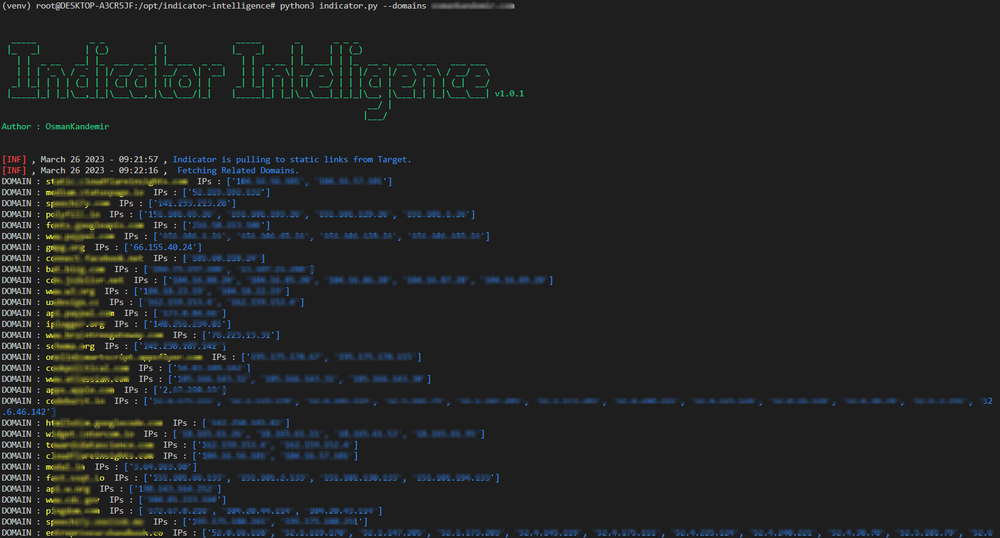

[](https://www.github.com/OsmanKandemir/indicator-intelligence)
[](https://github.com/OsmanKandemir/indicator-intelligence)
[](https://www.python.org)
[](https://raw.githubusercontent.com/smicallef/spiderfoot/master/LICENSE)
[](https://www.python.org)
[](https://www.docker.com)


# Indicator-Intelligence

#### NOTE : You should definitely use it for legal activities. Please See; [USAGE_POLICY.md](USAGE_POLICY.md) [LICENSE](LICENSE)

## Description

Indicator-Intelligence collects static files and related domains for target to do for threat intelligence.





## TODO
- [x] Releated domains collect
- [ ] Email, Ipv4, Ipv6 collect
- [ ] Result compare structure with Django
- [ ] Quick crawling optimization and more indicators
- [ ] Calculates hashes to threat analysis

## Installation

### From Source Code

You can use virtualenv for package dependencies before installation.

```
git clone https://github.com/OsmanKandemir/indicator-intelligence.git
cd indicator-intelligence
python setup.py build
python setup.py install
```

### From Pypi

The script is [available on PyPI](https://pypi.org/project/indicator-intelligence/). To install with pip:
```
pip install indicator-intelligence
```

### From Dockerfile

You can run this application on a container after build a Dockerfile.

```
docker build -t indicator .
docker run indicator --domains target.com --json
```

### From DockerHub

```
docker pull osmankandemir/indicator
docker run osmankandemir/indicator --domains target.com --json
```

### From Poetry

```
pip install poetry
poetry install
```

## Usage

```
-d DOMAINS [DOMAINS], --domains DOMAINS [DOMAINS] Input Targets. --domains sample.com sample2.com
-p PROXY, --proxy PROXY Use HTTP proxy. --proxy 0.0.0.0:8080
-a AGENT, --agent AGENT Use agent. --agent 'Mozilla/5.0 (Windows NT 10.0; Win64; x64)'
-o JSON, --json JSON  JSON output. --json
```

#### Pypi

```
from indicator import Indicator

#SCAN
Indicator(["domain.com"])

#OUTPUT
Indicator(["domain.com"],json=True)
```

## Development and Contribution

See; [CONTRIBUTING.md](CONTRIBUTING.md)


## License

Copyright (c) 2023 Osman Kandemir \
Licensed under the GPL-3.0 License.

## Donations
If you like Indicator-Intelligence and would like to show support, you can Buy A Coffee for the developer using the button below

<a href="https://www.buymeacoffee.com/OsmanKandemir" target="_blank"></a>

Your support will be much appreciated😊